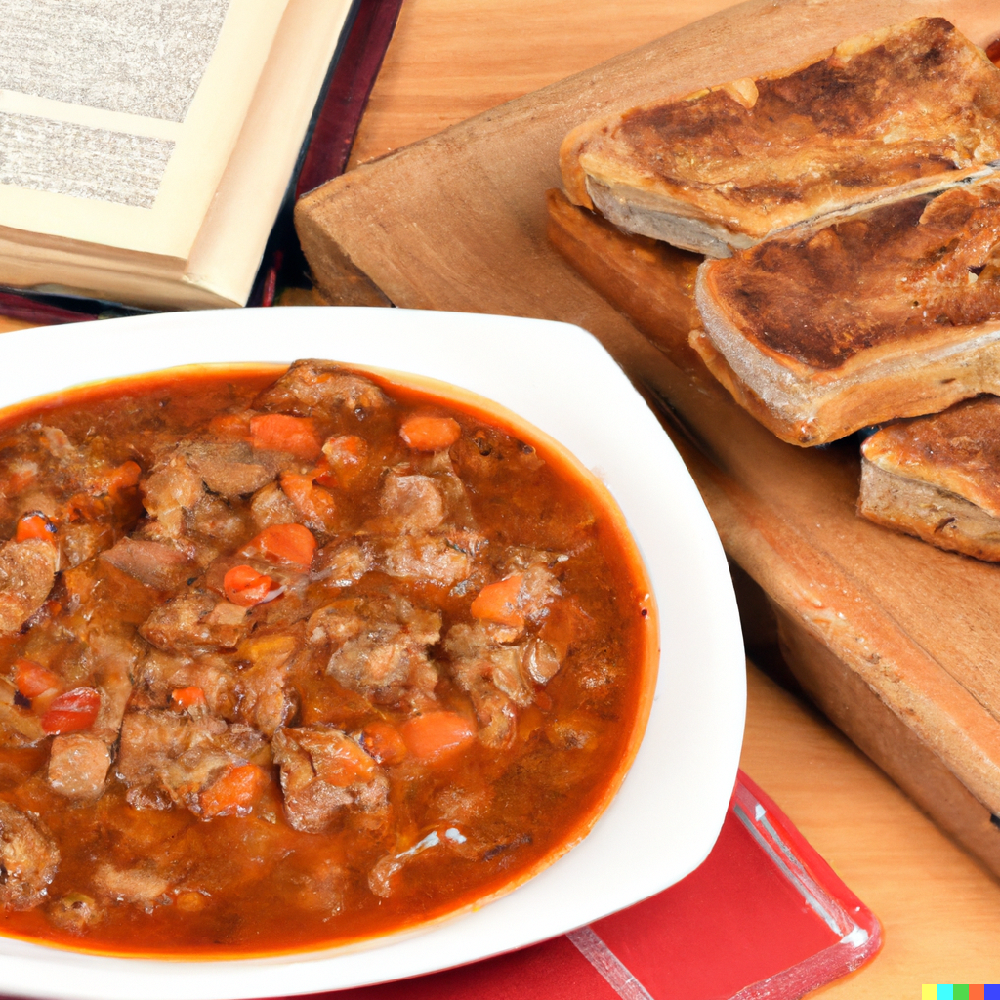

This wonderful Polish pork stew is brimming with complex flavour and tender meat. Ingredients like sauerkraut contribute to balancing the flavours, with acidity combining with fat and salt for delightful results.

**Ingredients**:

* 1 lb kielbasa sausage, sliced
* 1 lb beef stew meat, cubed
* 1 lb pork stew meat, cubed
* 1 large onion, chopped
* 2 cloves garlic, minced
* 1 cup sauerkraut, drained and rinsed
* 1 cup sliced mushrooms
* 2 cups chopped cabbage
* 1 can (14.5 oz) diced tomatoes
* 2 bay leaves
* 1 teaspoon dried thyme
* 1 teaspoon paprika
* 1 teaspoon caraway seeds
* Salt and black pepper to taste
* 2 cups beef broth
* 1/2 cup red wine
* 1 tablespoon flour
* 2 tablespoons butter

**Method**:

1. In a large pot, heat the butter over medium-high heat. Add the kielbasa sausage and brown for about 5 minutes. Remove the sausage from the pot and set aside.
2. Add the beef and pork to the pot and brown them on all sides for about 5-7 minutes. Remove the meat from the pot and set aside.
3. Add the chopped onion and minced garlic to the same pot and sauté for about 3-5 minutes, or until the onion is translucent.
4. Add the sauerkraut, sliced mushrooms, chopped cabbage, diced tomatoes, bay leaves, thyme, paprika, caraway seeds, salt, and black pepper to the pot. Stir to combine.
5. Pour in the beef broth and red wine, and bring the mixture to a boil. Reduce the heat to low and let the stew simmer for 2-3 hours, or until the meat is tender and the flavors have melded together.
6. Once the stew is cooked, remove the bay leaves and discard them. Mix the flour with 2 tablespoons of water until smooth and add it to the pot. Stir to thicken the stew.
7. Add the browned kielbasa and meat back to the pot and let it heat through for a few minutes.
8. Serve the Bigos hot, garnished with fresh parsley or chopped chives, and with some crusty bread on the side.

Serves: 6

Preparation time: 3.5 to 4 hours