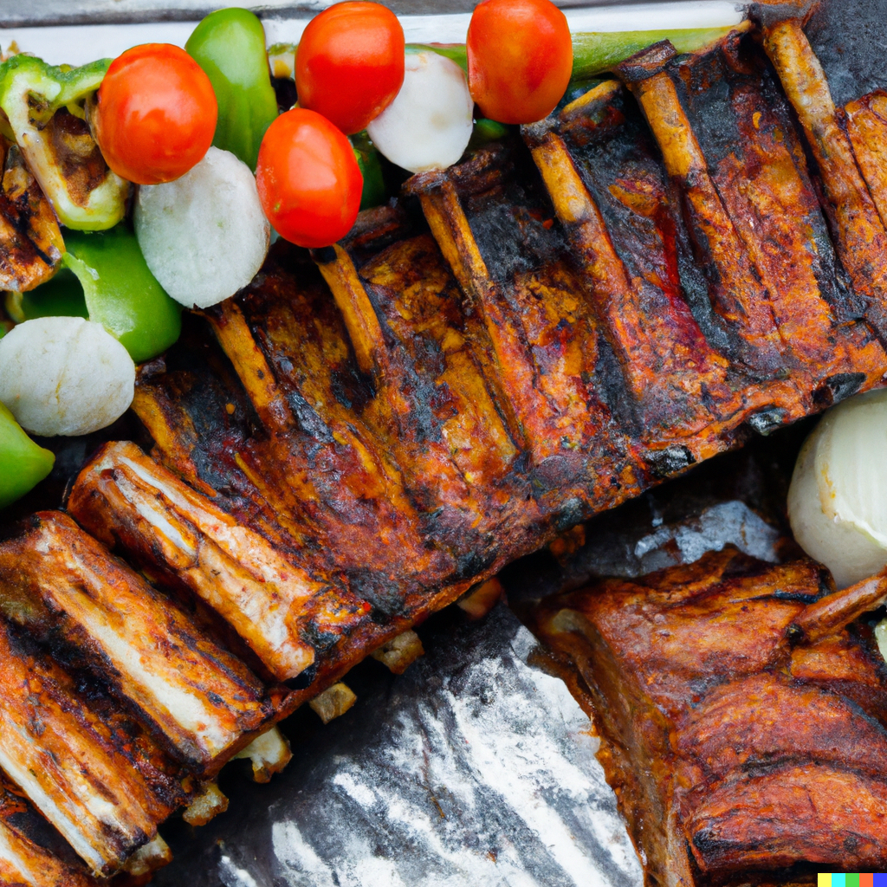

Fire up your grill for these wonderful pork ribs! Brimming with juice and flavour, these ribs will develop a deep-coloured crust and equally deep flavours. Accompanied by veggie skewers to compliment the rich meat, offering varied textures and levels of acidity to cut through the intesne pork flavours.

**Ingredients**:

For the ribs:

* 3 lbs pork ribs, cut into individual pieces
* 1/2 cup brown sugar
* 1/4 cup paprika
* 2 tablespoons salt
* 2 tablespoons black pepper
* 2 tablespoons garlic powder
* 2 tablespoons onion powder
* 1 tablespoon cayenne pepper
* BBQ sauce of your choice

For the vegetable skewers:

* 1 red bell pepper, cut into 1-inch pieces
* 1 yellow bell pepper, cut into 1-inch pieces
* 1 zucchini, sliced into rounds
* 1 yellow squash, sliced into rounds
* 1 red onion, cut into wedges
* 1/4 cup olive oil
* 2 tablespoons balsamic vinegar
* 1 tablespoon honey
* 2 garlic cloves, minced
* Salt and black pepper to taste
* Wooden skewers, soaked in water for 30 minutes

**Method**:

1. Preheat the grill to medium-high heat.
2. In a small bowl, mix together the brown sugar, paprika, salt, black pepper, garlic powder, onion powder, and cayenne pepper to create a dry rub. Rub the mixture over both sides of the pork ribs.
3. Grill the ribs for about 15 minutes on each side, or until cooked through and charred. Baste the ribs with BBQ sauce during the last 5 minutes of grilling.
4. While the ribs are cooking, prepare the veggie skewers. In a small bowl, whisk together the olive oil, balsamic vinegar, honey, minced garlic, salt, and black pepper.

Serves: 3-4 people

Preparation time: 2-3 hours