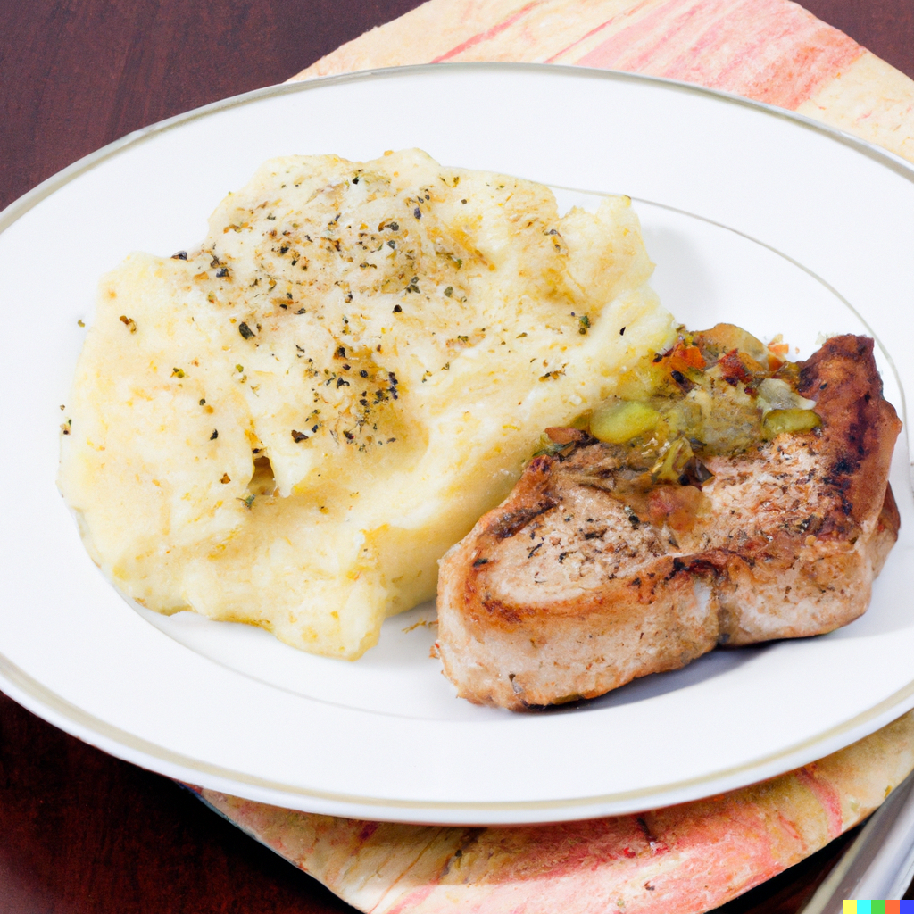

These braised pork chops have complex flavours from browning and are accompanied perfectly by buttery, creamy mashed potatoes. Tender and flavourful!

## Ingredients

* 4 bone-in pork chops (1 inch thick)
* 2 tablespoons olive oil
* Salt and black pepper to taste
* 2 cloves garlic, minced
* 1/2 teaspoon dried thyme
* 1/2 cup chicken broth
* 1 tablespoon unsalted butter
* 4 medium-sized potatoes, peeled and quartered
* 1/4 cup milk
* 2 tablespoons unsalted butter
* Salt and black pepper to taste

## Method

1. Preheat a large skillet over medium-high heat. Season the pork chops generously with salt and black pepper.
2. Add olive oil to the skillet and let it heat up for a few seconds. Add the pork chops to the skillet and cook for 3-4 minutes on each side, until golden brown. Remove the pork chops from the skillet and set aside.
3. Reduce the heat to medium and add garlic and thyme to the same skillet. Stir constantly for about 30 seconds or until fragrant.
4. Add chicken broth to the skillet and use a wooden spoon to scrape the brown bits from the bottom of the skillet. Add the pork chops back to the skillet and spoon the pan sauce over the pork chops. Cook for an additional 5-6 minutes or until the pork chops are cooked through and the internal temperature reaches 145°F.
5. While the pork chops are cooking, place the quartered potatoes in a pot and add enough water to cover the potatoes. Bring the water to a boil and cook the potatoes for 15-20 minutes or until they are fork-tender.
6. Drain the water from the potatoes and return them to the pot. Add milk, unsalted butter, salt, and black pepper to the pot. Mash the potatoes until they are smooth and creamy.
7. Serve the pork chops with the pan sauce spooned over them and a side of mashed potatoes.

* Serves: 4
* Preparation time: 50 Minutes